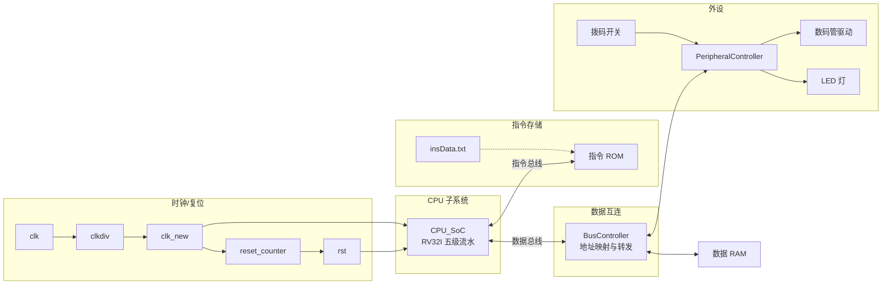
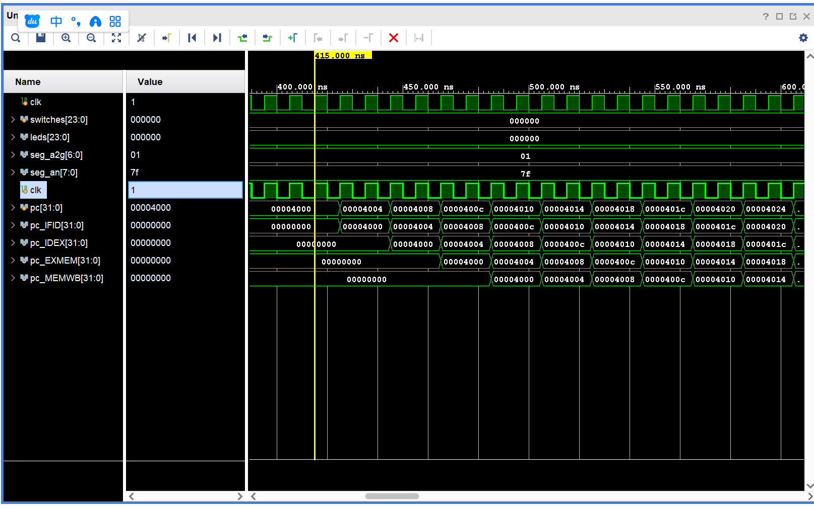

# 🚀 RISC-V 5-Stage Pipelined Processor SoC


这是一个基于 **RISC-V RV32I 指令集** 的五级流水线 CPU 及其片上系统（SoC）实现。本项目实现了完整的数字逻辑设计，包含冒险检测、数据前递以及丰富的外设交互。

---

## ✨ 核心特性

- **经典五级流水线**: 完备的 `IF` (取指) | `ID` (译码) | `EX` (执行) | `MEM` (访存) | `WB` (写回) 阶段。
- **硬件冲突处理**: 
  - 🏎️ **数据前递 (Forwarding)**: 解决 RAW 数据相关，最小化流水线停顿。
  - 🛑 **冒险检测 (Hazard Detection)**: 自动处理结构冒险、控制冒险与 Load-Use 冒险。
- **SoC 集成能力**:
  - 🧩 内置 `ROM` (4K x 32) 与 `RAM` (64 x 32)。
  - 📟 **外设控制**: 支持 24 位 LED 灯、24 位拨码开关以及数码管动态扫描。
- **工程化实践**:
  - 📝 包含详尽的硬件调试分析报告（JALR 指令冲突、寄存器损坏等）。
  - 🛠️ 提供 `compile_asm.bat` 自动化工具，实现 ASM 源代码到二进制指令流的一键转化。

---

## 🏗️ 系统架构

### 1. SoC 整体框架
项目采用了典型的总线互联结构，通过 `BusController` 管理 CPU 与存储器、外设之间的数据交换。



### 2. 仿真波形展示
项目包含完善的 Testbench，可通过 Vivado 观察流水线的运行状态：


*(图：五级流水线 PC 跳转与指令执行波形)*

### 3. 交互式冒泡排序演示
本项目包含一个与板级外设联动的交互式冒泡排序演示程序：

- 程序文件：`交互式冒泡排序_interactive.asm`
- 演示内容：通过拨码开关输入数据，在开发板上启动冒泡排序，并用 LED 与数码管反馈输入进度、运行状态和排序结果
- README 中的视频展示的就是该程序在 SoC 系统上的真实运行效果

交互流程概述：

- 使用拨码开关逐个输入待排序数字
- 使用确认操作锁存输入数据
- 输入完成后启动排序
- 通过 LED 和数码管观察排序执行结果

演示视频：

https://github.com/user-attachments/assets/463ceeeb-1554-4734-b3ad-6c3e87362677


---

## 📂 仓库结构

```text
boardtest/
├── boardtest.xpr          # Vivado 工程主文件
├── boardtest.srcs/        # 源代码目录
│   ├── sources_1/new/     # [核心] Verilog RTL 源码 (ALU, CPU, RegFile 等)
│   ├── constrs_1/new/     # [约束] FPGA 引脚分配 (1.xdc)
│   └── sim_1/new/         # [仿真] 流水线观察与功能验证
├── docs/                  # 实验报告与技术说明
├── compile_asm.bat        # ⚡ 汇编程序 -> 指令流转换脚本
├── 交互式冒泡排序_interactive.asm
│                         # 演示程序：交互式输入 + 冒泡排序 + 板级显示
└── BUG_REPORT_*.md        # 🛠️ 深度调试记录 (推荐阅读，涵盖复杂流水线 Bug 分析)
```

---

## 🚀 快速上手

### 1. 打开工程
- 环境要求：**Vivado 2025.1** (或兼容版本)。
- 双击 `boardtest.xpr` 载入工程。

### 2. 程序编译与更新
如果你想运行自己的汇编程序：
1. 编辑 `交互式冒泡排序_interactive.asm`，或替换为你自己的汇编程序。
2. 运行 `compile_asm.bat`，将汇编代码编译为新的 `insData_new.txt`。
3. 将 `insData_new.txt` 复制到 `boardtest.srcs/sources_1/new/insData.txt`。
4. 在 Vivado 中重新综合、生成 Bitstream，并下载到开发板。

当前仓库默认的板级演示程序就是交互式冒泡排序。README 中的视频展示的也是这个程序的实际运行过程。

### 3. 运行仿真
- 默认仿真顶层模块：`tb_pipeline_view`。
- 你可以清晰地观察到每条指令在五个阶段的平滑移动以及前递单元的介入。

---

## 🐞 调试记录与性能优化
本项目不仅是一份代码，更是一份详尽的 CPU 设计心得。建议阅读以下文档以深入了解设计细节：
- [x] [JALR 指令与延迟循环修复](./BUG_REPORT_JALR_AND_DELAY_LOOP.md) - 深入分析分支跳转的流水线冲突。
- [x] [X31 寄存器异常损坏排查](./BUG_REPORT_X31_REGISTER_CORRUPTION.md) - 关于寄存器写回冲突的经典案例。
- [x] [LED 延时与时序优化](./LED_TIMING_FIX.md) - 硬件外设的同步处理。

---

## 🤝 贡献
欢迎通过 Issue 交流关于 RISC-V 流水线设计的各种奇思妙想。

---
*Generated by Gemini CLI with ❤️*
